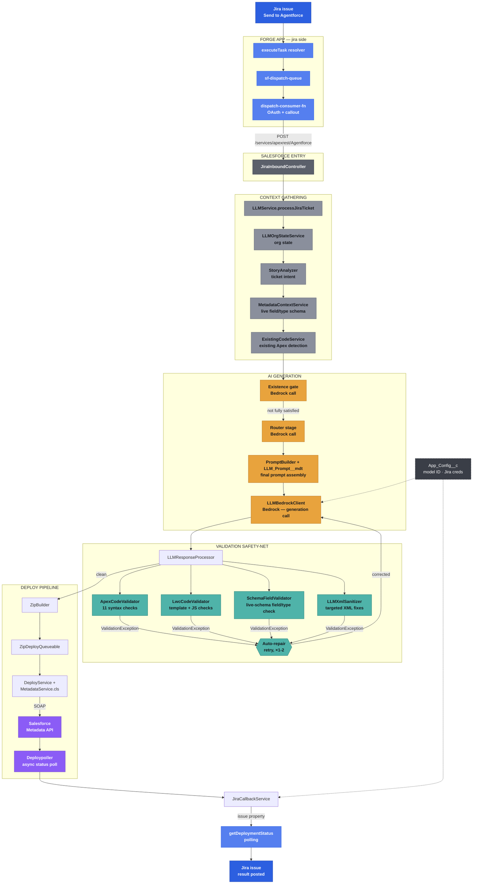

# Jira → AI → Salesforce Pipeline — Architecture

A ticket goes in as English. Working Salesforce metadata comes out. This traces every stage the request actually passes through — including the validation layer that catches the AI's mistakes before they ever reach a deploy.

## End-to-end flow

## Stage by stage

### 01 · Jira & the Forge app

_Not in this repo._

Clicking **Send to Agentforce** never blocks on Salesforce — it drops onto a queue and returns immediately, so the UI stays responsive no matter how long generation takes.

- **`index.js` — `executeTask`** — reads the user's stored Salesforce connection, pushes the ticket onto `sf-dispatch-queue`, returns "accepted" immediately.
- **`consumer.js` — `dispatch-consumer-fn`** — fetches the Jira issue body + attachments, resolves an OAuth token, calls Salesforce's REST endpoint.
- **`sfClient.js`** — token cache, refresh-on-401, the actual `fetch` to `/services/apexrest/Agentforce`.
- **`index.js` — `getDeploymentStatus`** — reads the `agentforce-deploy-status` Jira issue property. Polled by `index.jsx` every 3s, with a bounded timeout.

### 02 · Salesforce entry point

The REST resource Forge calls. Parses and validates the payload, then hands off to the orchestrator.

- **`JiraInboundController.cls`** — `@RestResource(urlMapping='/Agentforce')`. Parses the JSON body, decodes attachments, validates required fields, calls `LLMService.processJiraTicket`.

### 03 · Context gathering

Before anything is generated, the pipeline reads what's actually true about the org — this is the data the validation layer later checks generated output against.

- **`LLMOrgStateService.runOrgCheck`** — existing objects, fields, layouts, labels, queues, assignment rules — a snapshot of relevant org state.
- **`StoryAnalyzer.analyze`** — ticket text → structured intent: `needTrigger`, `needLwc`, `needTestClass`, `needHandler`, detected object/fields.
- **`MetadataContextService.buildContext`** — live `Schema.describe()` read — real field API names and real field _types_, not what a ticket or an earlier ticket assumed.
- **`ExistingCodeService.build`** — detects existing trigger/handler/service/selector classes so generation can extend rather than duplicate.

### 04 · Prompt assembly

Two systems combine into one final prompt — one lives in Apex and needs a deploy to change, the other lives in org data and doesn't.

- **`PromptService` + `LLM_Prompt__mdt`** — custom-metadata prompt fragments (`VALIDATION_RULE`, `APEX`, `LWC`, etc.), some always-included, most router-selected. Editable as org data — no code deploy required.
- **`PromptBuilder.build`** — Apex-hardcoded implementation rules, conditionally assembled from the `StoryAnalysis` flags — only pulls in Apex/LWC/trigger-specific guidance when the ticket actually needs it.

### 05 · AI generation

_Bedrock_

Up to three model calls per ticket: does this already exist, which prompt sections are relevant, then the real generation — plus up to two automatic repair calls if validation rejects the output.

- **`runExistenceGateStage`** — one call: "is everything requested already satisfied?" — lets a duplicate ticket skip deploy entirely.
- **`runRouterStage`** — one call: classifies which prompt sections apply, keeping the final prompt smaller and cheaper.
- **`LLMGroqClient` → `LLMBedrockClient.callBedrock`** — the actual model call — `deepseek.v3.2` via `App_Config__c.Bedrock_Model_Id__c`, `temperature: 0.15` for run-to-run consistency.

### 06 · Validation safety-net

_Catches mistakes before deploy_

Every generated file is mechanically checked against real rules and real org schema — not just trusted. A failure here triggers one automatic repair call with the specific, factual problem stated, before anything reaches a live deploy.

- **`ApexCodeValidator`** — 11 checks: unbalanced braces, `AND`/`OR` outside SOQL, `&&`/`||` inside SOQL, `WITH SECURITY_ENFORCED` misplacement, DML/SOQL-in-loops, untyped collections, TODO/placeholder text, empty handlers, missing null checks.
- **`LwcCodeValidator`** — template bindings restricted to simple property/getter references (no inline operators or function calls), no HTML entities inside `.js` source, blank/placeholder detection.
- **`SchemaFieldValidator`** — cross-checks field/object references against _live_ `Schema.describe()` data — validation-rule `TODAY()`/`NOW()` correctness against the field's real type, SOQL field existence, LWC `@salesforce/schema` imports. Tracks fields newly created in the same generation pass so it doesn't reject its own output.
- **`LLMXmlSanitizer`** — targeted, mechanical fixes: Profile `layoutAssignments` dedup, invalid regex escapes in Apex strings, Layout Name-field behavior, CustomObject defaults, ApexClass/ApexTrigger package.xml type correction by file extension.
- **`LLMLayoutHelper`, `LLMTriggerMerger`** — layout backstops for new fields, trigger-merge enforcement so multiple tickets don't create duplicate triggers on one object.
- **`AICodeReviewService`, `ResponseValidator`** — a second, LLM-adjacent review stage — present in the codebase but currently dead code (the calling block in `LLMService` is commented out and references a method that no longer exists). Not part of the live path today.

### 07 · Packaging & deploy

Validated files get zipped and sent through the Metadata API, with an async poller that respects Salesforce's own governor limits.

- **`ZipBuilder`** — stages files into a deployable package over a pure-Apex ZIP/DEFLATE implementation (`Zippex`/`Puff`/`HexUtil`); deploy scenario forced to `single` — object, fields, and layout deploy together in one round rather than two chained ones.
- **`ZipDeployQueueable` → `DeployService` → `MetadataService.cls`** — WSDL2Apex SOAP bindings to the Metadata API (including a hand-patched `ProfileFlowAccess` field the generator was originally missing).
- **`Deploypoller`** — polls deploy status asynchronously — fast `System.enqueueJob` hops kept under the platform's queueable chain-depth ceiling, falling back to `Deploypollerscheduler` (`System.schedule`) only when needed.
- **`ApexTestRunQueueable` + `ApexTestPollScheduler`** — a second repair loop, after deploy: for Apex-first tickets, runs the generated tests asynchronously, enforces a 75% coverage floor, and on failure re-invokes the LLM with the held-back second package to fix the code — not just a status poller.

### 08 · Feedback loop

The only thing Jira ever sees: a single property write, independent of however long deployment actually took.

- **`JiraCallbackService.storeDeploymentStatus`** — writes success/error/skipped + message to the `agentforce-deploy-status` Jira issue property via the Jira REST API.
- **Forge — `getDeploymentStatus`** — polled by the frontend until a fresh (non-stale) result appears, or the window elapses.

### 09 · Configuration

_Org data, not code_

Everything environment-specific lives in one custom setting — which is exactly where a mismatch hides if it's copied carelessly between orgs.

- **`App_Config__c`** — Hierarchy custom setting: Bedrock model ID, Jira base URL, Jira user email, Jira API token. The token is tied to the specific Atlassian account it was generated for — pairing one user's token with a different user's email fails Jira auth silently.
- **`Bedrock` named credential** — AWS SigV4 to `bedrock-runtime` — the only live model provider. `Groq_API_Key__c`/`Groq_Base_URL__c`/`Groq_Model__c` still exist on `App_Config__c` and a `Groq_API` named credential still exists too — vestiges of a prior provider; `LLMGroqClient` now just delegates straight to Bedrock regardless.
- **Jira auth** — no named credential — `JiraCallbackService` builds Basic Auth manually from the three `App_Config__c` fields above.

---

**Not part of the pipeline:** the LWCs and Apex classes the pipeline _generates_ for test tickets — `Reservation__c`, `contactDirectory`, `accountWorkspace`, and so on — are output, not infrastructure. They live in the Salesforce org but carry none of the guarantees above once deployed; they're just ordinary Salesforce metadata from that point on.
